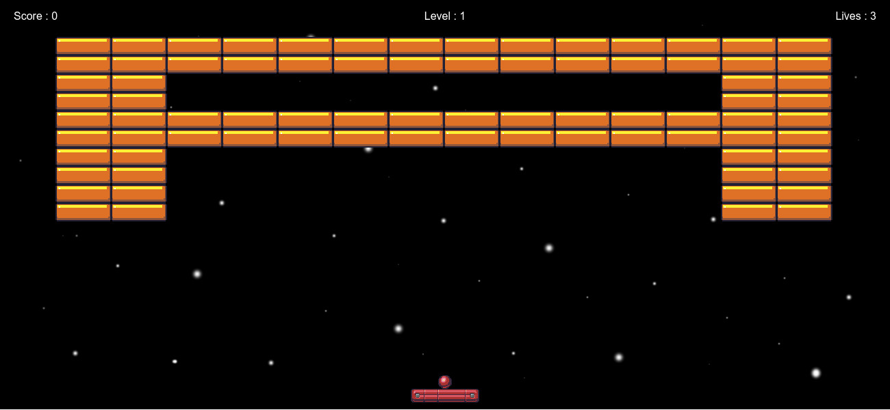

# Breakout

## Project Overview

### What does this project do?
An Atari Breakout clone created using HTML5 and JavaScript.

### Why is this project useful?
This project introduces users to HTML5 Canvas, DOM manipulation, and JavaScript for game development. It fosters creativity and collaboration, encouraging the community to contribute ideas—whether they're crazy or innovative.

### How do I get started?
1. Check the issues section and identify a task you can fix.
2. Follow JavaScript ES2015 coding standards in all commits.
3. If you have a new improvement idea, create a new issue.
4. Discuss solutions with your peers to find the best approach.

## How to Play

1. Control the platform using the **left** and **right arrow keys**.
2. Keep the ball bouncing to hit and destroy all blocks on the screen.
3. Win by clearing all blocks.
4. You have **three lives**:
   - Lose a life if the ball falls off the screen.
   - Lose the game if you run out of lives.

